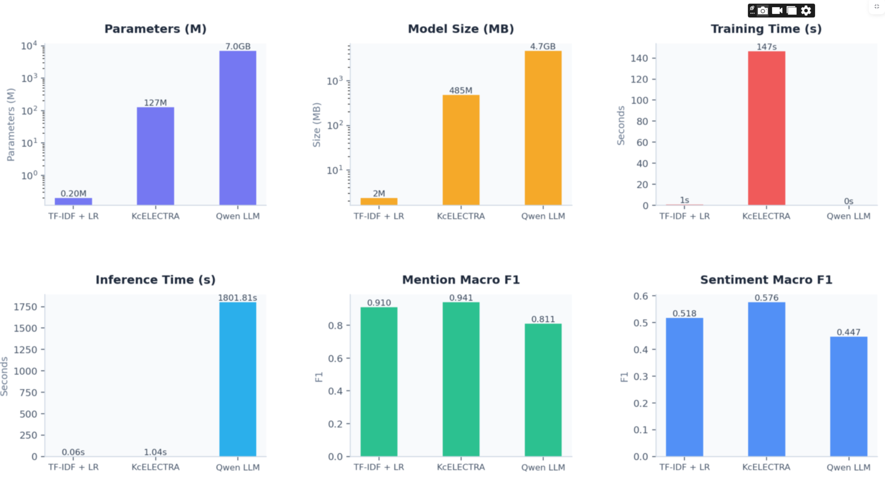

# Korean ABSA Benchmarking

Benchmarking Classical ML, Transformer, and LLM Approaches for Aspect-Based Sentiment Analysis on Korean restaurant reviews.

---

## Project Overview

This project compares three approaches to **Aspect-Based Sentiment Analysis (ABSA)** — the task of identifying sentiment at the aspect level rather than for an entire review. 

Traditional sentiment classification works at the sentence level, but real-world reviews often mix opinions across different aspects. ABSA tackles this by identifying sentiment for each aspect separately

For example:

> "음식은 맛있었는데 서비스가 너무 별로였어요."
> → FOOD: Positive, SERVICE: Negative

Target Aspects : **FOOD**, **PRICE**, **SERVICE**, and **AMBIENCE**.

Results Snapshot: 


---

## Features
- Multi-aspect sentiment classification
- End-to-end comparison: ML vs Transformer vs LLM
- Efficiency benchmarking (performance vs speed vs size)
- Interactive Streamlit dashboard

## Models

### TF-IDF + Logistic Regression
- ~200K parameters : 2.36 MB
- Two-stage pipeline: mention detection → sentiment classification
- Character n-gram TF-IDF (char_wb) handles Korean morphology
- Best for: real-time / low-resource systems

### KcELECTRA
- ~128M parameters : 485 MB
- Fine-tuned Korean ELECTRA
- Joint multi-output classification (mention + sentiment heads)
- Best for: balanced performance in production

### Qwen 2.5 LLM
- ~7B parameters : 4.7 GB (served via Ollama)
- Prompt-based, no fine-tuning
- Strong on implicit and multi-aspect sentiment
- Best for: complex reasoning scenarios

---

## Dataset

- **Source:** [M-ABSA](https://huggingface.co/datasets/Multilingual-NLP/M-ABSA) — a multilingual ABSA corpus covering 21 languages and 7 domains
- Filtered for Korean, restructured, and relabeled to the four target aspects
- Labels: `0 = Not Mentioned`, `1 = Negative`, `2 = Positive`
- Split: 70% train / 15% validation / 15% test via `MultilabelStratifiedShuffleSplit`
- Preprocessing details: see `dataset_logs.md`

---

## Results

### Per-Aspect F1

| Aspect | TF-IDF + LR | KcELECTRA | Qwen 2.5 |
|---|---|---|---|
| FOOD | 0.787 | **0.876** | 0.540 |
| PRICE | 0.788 | **0.818** | 0.690 |
| SERVICE | 0.783 | **0.891** | 0.770 |
| AMBIENCE | 0.719 | **0.780** | 0.522 |

- KcELECTRA leads across all four aspects

###  Efficiency & Model Complexity

| Model          | Parameters | Size on Disk | Inference Time (s) |
|----------------|-----------|--------------|------------------|
| TF-IDF + LR    | 192k | 2.36 MB |  0.05 |
| KcELECTRA      | 127M       | 485.28 MB       | 1.04 |
| Qwen 2.5 LLM   | 7B         | 4700 MB      | 1801 |

### Hard Multi-Aspect Cases (n=29)

Percentage of Misclassified aspects on a set of complex multi aspect reviews (`hard_example_set.csv`):

| Aspect | TF-IDF + LR | KcELECTRA | Qwen 2.5 |
|---|---|---|---|
| FOOD | 52 |26 | **21.7**|
| PRICE | 25| 25| **8.3**|
| SERVICE | 19| 19| **9.5**|
| AMBIENCE | 58 | 32| **21.4**|

- Qwen 2.5 outperforms the other models on hard cases despite its lower standard benchmark scores.

---

## 📁 Project Structure

```
project/
├── assets/                   
│   ├── demo.mp4                # Short demo of the Streamlit app
│   ├── model_comparison.png    # Figure of model comparison
│   └── hard_example_comparison.png  # Plot on multi aspect hard cases
│
├── data/                      
│   ├── hard_example_set.csv    # Challenging samples
│   ├── manual_samples.csv      # Hand-crafted examples
│   └── multi_class_df.csv      # Main processed dataset for ABSA
│
├── docs/                       # Documentation and reports
│   ├── dataset_logs.md         # Notes on dataset processing and structure
│   └── tech_report.md          # Detailed technical explanation of models
│
├── notebooks/                  # Jupyter notebooks for experimentation
│   ├── model_training_inference.ipynb  # A full Training + inference pipelines
│   └── preprocessing.ipynb     # Data cleaning and preprocessing steps with visualization
│
├── results/                    # Evaluation outputs and metrics
│   ├── overall_metrics.csv     # Overall model comparison results
│   └── aspect_metrics.csv      # Metrics broken down by aspect
│
├── src/                       
│   ├── data_processing/        # Data preparation utilities
│   │   ├── build_labels.py
│   │   ├── multilabel_split.py
│   │   ├── process_dataset.py
│   │   └── __init__.py
│   │
│   ├── evaluation/             # Evaluation and analysis tools
│   │   ├── classification_report.py
│   │   ├── confusion_matrix.py
│   │   ├── error_eval.py
│   │   ├── load_models.py      # Loads trained LR + KcELECTRA models
│   │   └── __init__.py
│   │
│   ├── kc_electra/             # Transformer-based ABSA implementation
│   │   ├── build_dataset.py
│   │   ├── class_weights.py
│   │   ├── compute_loss.py
│   │   ├── compute_metrics.py
│   │   ├── decode_prediction.py
│   │   ├── helper_utils.py
│   │   ├── model.py            # Shared ABSA wrapper model
│   │   ├── tune_thresholds.py
│   │   └── __init__.py
│   │
│   ├── ollama_llm/             # LLM-based inference (Qwen via Ollama)
│   │   ├── build_prompt.py
│   │   ├── inference.py
│   │   ├── query.py            # Handles API calls to local LLM
│   │   └── __init__.py
│   │
│   ├── tfidf_lr/               # Classical ML pipeline
│   │   ├── model.py            # TF-IDF + Logistic Regression
│   │   ├── param_and_size.py
│   │   └── __init__.py
│   │
│   └── __init__.py             # Makes src a Python package
│
├── weights/                    # Saved model weights and configs
│   ├── kc_electra/             # Fine-tuned transformer model
│   │   ├── aspects.json
│   │   ├── kc_electra.pt
│   │   ├── special_tokens_map.json
│   │   ├── thresholds.json
│   │   ├── tokenizer.json
│   │   ├── tokenizer_config.json
│   │   └── vocab.txt
│   │
│   └── lr_model.pkl            # Trained Logistic Regression model
│
├── .gitignore                  # Files ignored by Git
├── README.md                   # Project overview and instructions
├── requirements.txt            # Python dependencies
└── app.py                      # Streamlit demo application with live review and results
```

---

## Setup & Usage

### 1 Requirements

- Python 3.8+
- Jupyter Notebook (for running .ipynb files)
- Dependencies listed in requirements.txt


### 2 Install Dependencies
``` pip install -r requirements.txt ```

### 3 Run the Streamlit App

```bash
streamlit run app.py
```

The app provides:
- **Live review analyzer** — input a Korean restaurant review and get real-time ABSA predictions from all three models
- **Model comparison dashboard** — per-aspect F1 scores, overall metrics, and efficiency comparisons and visualizations
 **A short demo video of the app is included inside assets folder** 

### Run Qwen 2.5 via Ollama

Step 1:  Install Ollama from:
👉 https://ollama.com 

Step 2: Pull the Model

```bash
ollama pull qwen2.5:7b-instruct
```
Step 3: Start Ollama Server
```
ollama serve
```
---

### 5. Setup Requirements

Before running the project, ensure:

- Model weights are placed in the weights/ directory
- results/ folder exists (or will be auto-created) for saving outputs
- Ollama is running locally for Qwen inference
- (Optional) GPU is available for faster KcELECTRA inference

## Limitations

- **No off-the-shelf dataset covering target aspects (FOOD, PRICE, SERVICE, AMBIENCE) in Korean existed.** The M-ABSA corpus required significant adaptation, introducing label noise .
- **Class imbalance** across mention detection and sentiment labels — each model addresses this differently (balanced weights for LR, computed class weights for KcELECTRA, no mechanism for Qwen).
- **Qwen 2.5** requires one-review-at-a-time inference to avoid output collapse, making it impractical for large-scale evaluation.

---

## Future Improvements

- Fine-tune Qwen 2.5 or similar or larger LLMs
- Build a native Korean restaurant review ABSA dataset
- Explore aspect-aware attention on top of KcELECTRA
- Extend ABSA to other domains (e-commerce, hotels, etc.)

